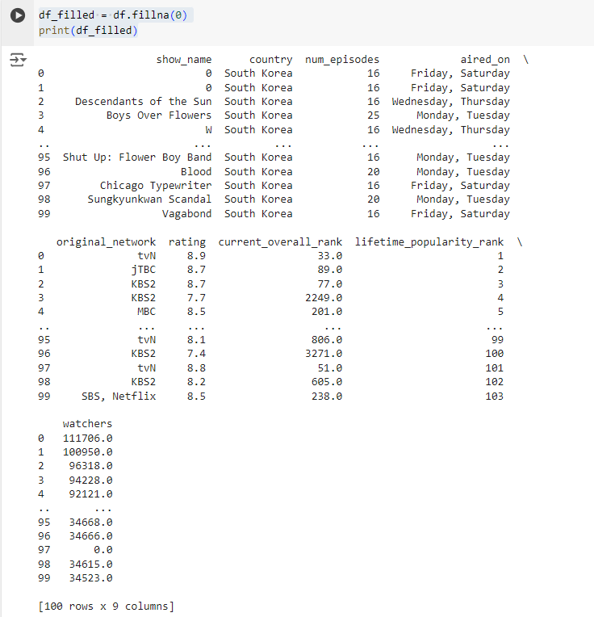

# Exno:1
Data Cleaning Process

# AIM
To read the given data and perform data cleaning and save the cleaned data to a file.

# Explanation
Data cleaning is the process of preparing data for analysis by removing or modifying data that is incorrect ,incompleted , irrelevant , duplicated or improperly formatted. Data cleaning is not simply about erasing data ,but rather finding a way to maximize datasets accuracy without necessarily deleting the information.

# Algorithm
STEP 1: Read the given Data

STEP 2: Get the information about the data

STEP 3: Remove the null values from the data

STEP 4: Save the Clean data to the file

STEP 5: Remove outliers using IQR

STEP 6: Use zscore of to remove outliers

# Coding and Output

# Developed By: GOKHULRAJ V
# Register Number: 212223230064


### 1) Read and display DataFrame
```py
import pandas as pd
import numpy as np
data=pd.read_csv("/content/Data_set.csv")
```
### output


### 2) Display head
```py
df = pd.DataFrame(data)
print(df)
df.head()
```
### output 


### 3) Display tail
```Python
df.tail()
```
### output 


### 4) Info of datafram
```Python
df.info()
```
### output


### 5) To Find Null Value
```py
df.isnull().sum()
```
### output


### 6) Describe
```py
df.describe()
```
### output


### 7) Fillna Method
```py
df_filled = df.fillna(0)
print(df_filled)
```
### output


### 8) Forward and Backward
```py
df_ffilled = df.ffill()
print(df_ffilled)
```
### output


```py
df_bfilled = df.bfill()
print(df_bfilled)
```
### output


### 9) Dropna
```py
df.dropna()
```
### output


### 10) iloc
```py
df.iloc[:4]
```
### output


### 11) CALCULATE MEAN VALUE OF A COLUMN AND FILL IT WITH NULL VALUES
```py
df_mean1=df['num_episodes'].fillna(df['num_episodes'].mean())
df_mean1
```
### output

```py
df_mean3=df['current_overall_rank'].fillna(df['current_overall_rank'].mean())
df_mean3
```
### output


# IQR
### 12) Read and Display
```py
import pandas as pd
import seaborn as sns
df=pd.read_csv('/content/heights (1).csv')
print(df)
```


### 13) USE BOXPLOT FUNCTION HERE TO DETECT OUTLIER
```py
sns.boxplot(df)
```
### output


### Scatterplot
```py
sns.scatterplot(df)
```
### output


### Mean
```py
mean=np.mean(data)
mean
std=np.std(data)
std
```
### output


# z score
```py 
from scipy import stats
import numpy as np
import pandas as pd
import seaborn as sns
data=[1,12,15,18,21,24,27,30,33,36,39,42,45,48,51,54,57,60,63,66,69,72,75,78,81,84,87,90,93,96,99,158]
df=pd.DataFrame(data)
df=pd.DataFrame(data)
mean=np.mean(data)
mean

std=np.std(data)
std
z=np.abs(stats.zscore(df))
z
```
### output


### Remove outliers
```py
df_cleaned = df[(z <= threshold)]
df_cleaned
```
### output

### USE BOXPLOT FUNCTION HERE TO CHECK OUTLIER IS REMOVED
```py
sns.boxplot(df_cleaned)
```
### output

```py
sns.scatterplot(df_cleaned)
```
### output

# Result
Thus the code executed successfully.
